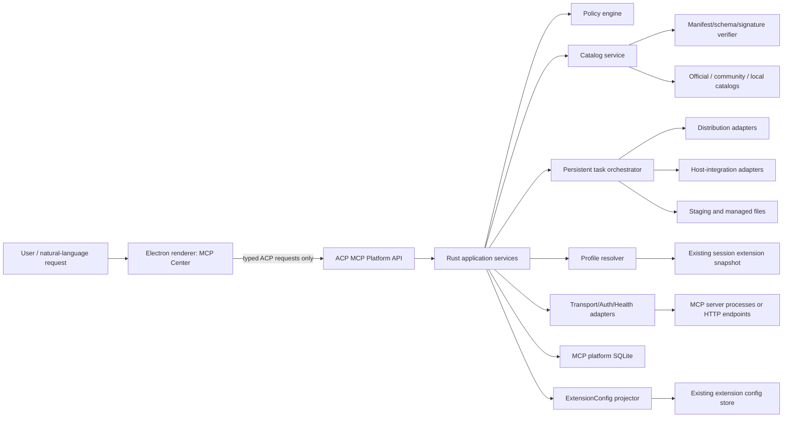
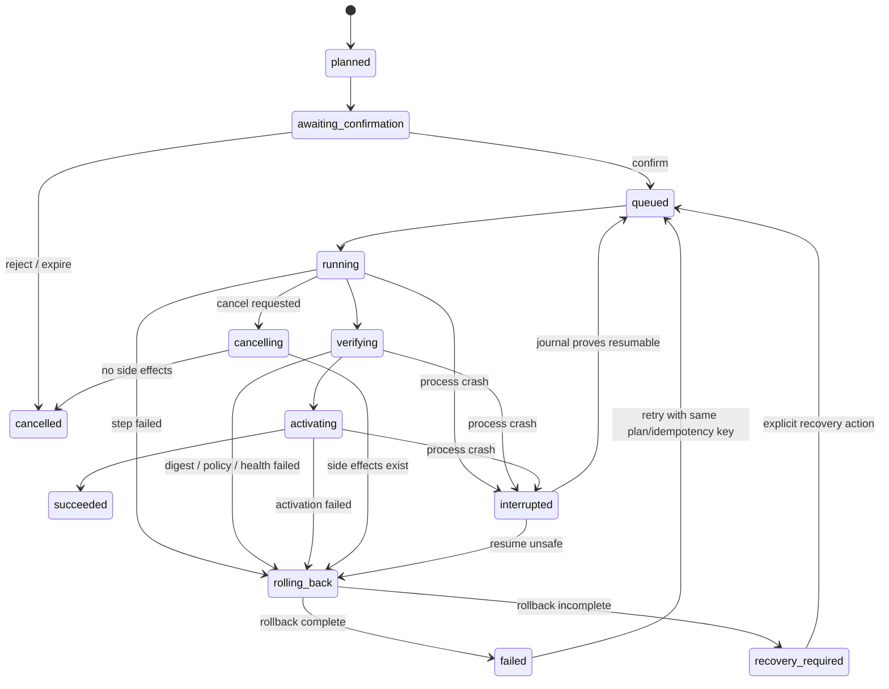
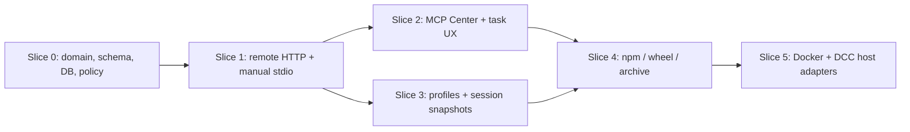

# MCP Platform Architecture

## 1. Scope and invariants

This document defines a general-purpose MCP package, connection, and profile platform for ordinary goose users. Unreal Engine, Houdini, and Nuke are validation cases for a later host-integration layer; they do not define the product boundary.

The platform is an enterprise/complex desktop product surface: it has trusted catalogs, permissions, persistent jobs, rollback, audit records, profiles, and destructive actions. This phase is an architecture and contract only. It does not authorize Rust or renderer implementation.

The following are invariants:

- Rust Core is the only authority for manifests, catalogs, plans, policy decisions, install jobs, checksums, owned files, state, activation, rollback, and recovery.
- The Electron renderer calls typed ACP operations. It never executes a command, receives an install command to execute, or constructs an executable lifecycle step.
- Connection configuration, software installation, runtime process state, health, default enablement, session enablement, and tool permissions are independent state dimensions.
- A newly installed or registered MCP is disabled by default. It becomes a session candidate only after successful verification and an explicit enable action.
- Manifests are declarative. Arbitrary lifecycle command strings and pre/post-install hooks are forbidden.
- Release catalogs contain exact versions. `latest`, floating package ranges, mutable tags, and unpinned Git references are rejected by policy.
- Production catalog inputs are version locked and publisher/hash/signature verifiable. `git_dev` is accepted only in an explicit local/development trust mode.
- All platform storage derives from `Paths::data_dir()`, `Paths::config_dir()`, or another `Paths` method. It never assumes `%LOCALAPPDATA%`, a home-directory spelling, or a repository checkout.
- Persistent jobs recover after process crashes and support cancel, failure, retry, and rollback. Installation uses staging, verification, and atomic activation.
- Profiles keep named template references, while each session stores a resolution snapshot. Updating a template never mutates an existing session silently.
- Natural language may produce an auditable `InstallationPlan` or `ProfilePlan`. Policy validation and user confirmation remain mandatory; a model cannot invoke the execution boundary directly.

## 2. Existing-system seam

Today, `ExtensionConfig` represents runtime connection information (`stdio`, `streamable_http`, built-in, or platform) and `ExtensionEntry.enabled` represents the default for new sessions. ACP conversion intentionally omits literal environment values and references stored keys. `resolve_extensions_for_new_session` selects recipe, override, or globally enabled connections, and session `extension_data` persists the result in `sessions.db` under `Paths::data_dir()/sessions`.

The MCP platform is upstream of that seam:

```text
Package/Catalog/Install state -> verified InstalledMcp -> generated ExtensionConfig
                                                        -> existing session resolution
```

This is a one-way projection. Installation source, artifact digest, file ownership, task journal, publisher proof, host registration, and rollback metadata never enter `ExtensionConfig`. Editing or removing an `ExtensionConfig` does not claim to uninstall software. The platform stores a stable `managed_mcp_id` linkage outside the legacy connection object and reconciles its generated connection when managed state changes.

## 3. Component boundaries



### Authority boundaries

| Component | Owns | Must not own |
|---|---|---|
| Renderer | Presentation state, focus, local draft filters, confirmation intent | Manifests as authority, policy decisions, shell execution, file mutation |
| ACP API | Typed serialization, authentication of the local client, event subscription | Business rules duplicated from Core |
| Application services | Use-case orchestration and transaction boundaries | Adapter-specific process/download details |
| Domain + policy | Invariants, state transitions, plan validity, trust decisions | UI layout or SQLite statements |
| Repositories | Durable domain records and migrations | Network or process side effects |
| Adapters | Narrow external effects described by approved plans | Choosing permissions or bypassing policy |

## 4. Six orthogonal adapter families

An MCP package is a composition of six independent adapter families. A distribution adapter and a host-integration adapter are deliberately separate: installing a binary is not the same operation as registering it with a DCC host.

| Adapter | Responsibility | Initial/next implementations | Extension contract |
|---|---|---|---|
| `DistributionAdapter` | Resolve, acquire, stage, verify, activate, repair, and remove a distribution | First: `remote_http`, `manual_stdio`; then `npm`, `python_wheel`, `binary_archive`, `docker`; `git_dev` only for dev/local | Pure plan generation plus idempotent typed steps; reports artifacts and owned files |
| `HostIntegrationAdapter` | Detect a host and apply/remove declarative registration actions | Later: Unreal Engine, Houdini, Nuke | Accepts typed `copy_file`, `write_config_fragment`, and `register_plugin` actions only |
| `TransportAdapter` | Produce/connect a runtime channel | `stdio`, `streamable_http` | Produces a connection descriptor, never installation state |
| `AuthAdapter` | Declare credential requirements and resolve opaque credential handles | `none`, environment, API-key header, OAuth 2 | Core supplies resolved values only at connection time; values are redacted elsewhere |
| `HealthCheckAdapter` | Verify registration/runtime/MCP readiness | `mcp_initialize`, `mcp_list_tools`, constrained HTTP status | Returns structured observations and timestamps, not a generic command result |
| `PolicyAdapter` | Evaluate catalog trust, platform fit, permissions, paths, versions, signatures, and confirmation | built-in local policy initially; enterprise policy later | Deterministic `allow`, `deny`, or `needs_confirmation` with reason codes |

### Composition rules

1. A manifest selects exactly one distribution, one transport, one auth contract, and one health check. It may select zero or more host integrations.
2. `remote_http` requires `streamable_http`; `manual_stdio` requires `stdio`. Other distributions may expose either supported transport if their adapter can produce it.
3. Adapter capability negotiation happens before a plan is persisted. Missing platform/architecture support is a plan error, not an install-time surprise.
4. Host integration runs only after distribution verification and before final activation. Its owned files join the same rollback set.
5. Auth is configured independently from installation. Missing credentials may leave a package installed but health `blocked_auth` and disabled.
6. Tool permission selection occurs after health discovery. Manifest permissions describe package-level effects; discovered tool permissions are stored as a separate user policy.
7. Adapter versions are recorded in the plan and task journal. Recovery uses a compatible adapter or stops with `recovery_required`; it never guesses a new procedure.

## 5. Manifest v1 contract

The normative machine contract is [`mcp-package-manifest-v1.schema.json`](/schemas/mcp-package-manifest-v1.schema.json), JSON Schema Draft 2020-12. Unknown top-level and variant fields are rejected.

### Field model

| Field | Purpose and invariant |
|---|---|
| `schema_version` | Integer constant `1`; independent from package version |
| `id` | Stable, publisher-scoped MCP identity; unchanged across releases |
| `version` | Exact SemVer; never `latest`, a range, or a mutable channel |
| `name`, `description`, links | User-facing catalog metadata; links use HTTPS |
| `publisher`, `license` | Publisher identity/signing identifiers and SPDX or explicit `LicenseRef` |
| `capabilities` | Declared MCP surfaces such as tools, resources, and prompts |
| `permissions` | Stable permission IDs, effect kind, reason, required flag, and bounded scope |
| `distribution` | Closed `oneOf` for all distribution adapter variants |
| `transport`, `auth`, `health_check` | Independent typed adapter declarations |
| `host_integrations` | Optional, declarative host detection and registration actions |
| `owned_files` | Root-relative exact files/directories eligible for rollback or uninstall |
| `uninstall` | Removal is limited to owned files and declared host registrations |

`npm`, `python_wheel`, and `binary_archive` declare platform/architecture-selectable HTTPS artifacts with SHA-256 digests. Docker uses an immutable image digest. `git_dev` requires a 40-character commit and still passes policy; it is not a release-catalog escape hatch. Platform matching is deterministic: prefer an exact `(platform, arch)`, then `(platform, any)`, then `(any, arch)`, then `(any, any)`; equal-specificity duplicates are invalid by policy.

Entrypoints contain an executable and argument vector because stdio requires a process. They are not passed through a shell, do not support command substitution, and are interpreted only by the owning distribution/transport adapter. Template variables come from an allowlist (`installation`, `host`, and user-reviewed selections); unknown variables fail planning.

The JSON Schema cannot express catalog provenance and cross-document immutability. The Policy layer additionally rejects:

- `git_dev` in official/community release catalogs;
- `latest`, ranges, mutable Docker tags, or catalog entries whose index version and manifest version disagree;
- absent or mismatched catalog/index/manifest/artifact hashes;
- untrusted, expired, or revoked publisher signatures;
- duplicate artifact selectors, path traversal after template expansion, and ownership outside approved roots;
- any field or external metadata that attempts to introduce an arbitrary lifecycle command.

### Version evolution

- Additive fields that v1 consumers can safely ignore are not allowed inside the v1 schema because `additionalProperties: false` is intentional. They require a published schema revision and coordinated reader support.
- A semantic change or new executable capability requires `schema_version: 2`, a new schema URL, migration documentation, and an explicit Core compatibility gate.
- Catalog entries advertise supported schema versions. Unknown major schema versions remain visible as incompatible metadata but cannot be planned or installed.
- Stored manifests are immutable blobs keyed by `(mcp_id, version, manifest_digest)` so later catalog refreshes cannot rewrite install history.

## 6. Orthogonal state model

One label such as “installed” cannot represent the platform. The aggregate exposes these independent dimensions:

| Dimension | Values (minimum) |
|---|---|
| Registration | `absent`, `registered` |
| Installation | `not_applicable`, `not_installed`, `staged`, `installed`, `update_available`, `repair_required`, `uninstall_pending` |
| Runtime | `stopped`, `starting`, `running`, `stopping`, `crashed` |
| Health | `unknown`, `checking`, `healthy`, `degraded`, `unhealthy`, `blocked_auth`, `incompatible` |
| Default enabled | Boolean, default `false` |
| Session enabled | Per-session Boolean resolved from a snapshot |
| Tool permission | Per discovered tool: `ask`, `allow`, `deny` plus optional scope |

Only a verified `registered|installed` object with explicit default or session enablement can be projected into a session. Runtime crashes do not erase installation, and disabling does not stop the user from running a manual health check.

## 7. Lifecycle and persistent task journal

### Install/update/repair/uninstall task state



Update stages a complete new version beside the active version, verifies it, atomically swaps an activation pointer, then retains the previous version until commit cleanup. Repair re-verifies the active manifest, artifacts, connection, and owned files, restoring only declared missing/corrupt content. Uninstall first disables new-session use, stops owned runtime instances, removes declared host integration and owned files, and retains user data when requested.

Every task has a stable `task_id`, immutable `plan_id`, client `idempotency_key`, operation, target, requested/confirmed actor, status, cancellability, step cursor, adapter versions, timestamps, heartbeat, progress, redacted error, rollback status, and event sequence. Each effect step records `not_started`, `started`, or `committed`, plus an idempotency token and compensating action descriptor. On startup, stale `running` tasks become `interrupted` and are recovered under the recorded adapter contract. Cancellation is cooperative; the UI shows “cancelling” until a safe boundary.

### Runtime and health transitions

Runtime state is maintained per managed MCP instance and session. Health observations include check type, target version, result code, latency, discovered capabilities/tools digest, and checked time. A successful health check never enables the MCP automatically. A failed health check can block confirmation or enablement according to policy without erasing the installed version.

## 8. SQLite persistence boundary

Use a separate database such as `Paths::in_data_dir("mcp-platform/platform.db")`. Keep managed installations under `Paths::in_data_dir("mcp-platform/installations")`, staging under the same filesystem to preserve atomic rename semantics, and cache/catalog blobs under `Paths::in_data_dir("mcp-platform/cache")`. Do not add platform tables to `sessions.db`; session deletion, export, or migration must not mutate package inventory.

Suggested tables and keys:

| Table | Primary/unique keys | Purpose |
|---|---|---|
| `schema_version` | `version` | Monotonic, transactional database migrations |
| `catalog_sources` | `source_id`; unique `(trust_tier, canonical_uri)` | Source policy, pinned index version/hash, cache metadata |
| `catalog_entries` | `(source_id, mcp_id, version)` | Immutable index metadata and revocation state |
| `manifest_blobs` | `manifest_digest`; unique `(mcp_id, version, manifest_digest)` | Canonical verified manifest bytes and signature proof |
| `managed_mcps` | `managed_mcp_id`; unique `(mcp_id, installation_scope)` | Registration/install aggregate and active version |
| `managed_versions` | `(managed_mcp_id, version)` | Installation root, manifest digest, verification/activation status |
| `connection_projections` | `managed_mcp_id`; unique `extension_config_key` | One-way link to generated `ExtensionConfig` |
| `owned_files` | `(managed_mcp_id, version, root, relative_path)` | Expected digest/type, uninstall ownership, host integration ID |
| `install_plans` | `plan_id`; unique `idempotency_key` | Immutable reviewed plan and policy decision digest |
| `tasks` | `task_id`; unique `(operation, idempotency_key)` | Durable operation journal and progress |
| `task_steps` | `(task_id, ordinal)`; unique `(task_id, step_idempotency_token)` | Resume/compensate evidence |
| `runtime_instances` | `runtime_id`; unique `(managed_mcp_id, session_id)` where applicable | Runtime state without conflating install state |
| `health_observations` | `observation_id`; index `(managed_mcp_id, checked_at)` | Append-only health evidence |
| `profiles` | `profile_id`; unique normalized name | Named template and revision |
| `profile_entries` | `(profile_id, mcp_id)` | Stable ID plus exact/range/channel policy and desired tool policy |
| `profile_resolutions` | `resolution_id`; unique `(session_id, profile_id)` | Session snapshot with exact version/manifest digest |
| `tool_policies` | `(scope_type, scope_id, managed_mcp_id, tool_name)` | Default/session permission, never install state |
| `audit_events` | `(event_id)`; unique `(actor_id, idempotency_key, event_type)` | Append-only security and lifecycle audit |

Write transactions use foreign keys, WAL, a busy timeout, and `BEGIN IMMEDIATE` for read-then-write transitions, consistent with current session storage practice. Migrations run sequentially in one transaction, are forward-only, back up or checkpoint before destructive transformations, and leave unknown newer versions unopened. Domain repositories expose typed rows; services do not issue ad hoc SQL.

## 9. Suggested Rust module layout

```text
crates/goose/src/mcp_platform/
├── mod.rs
├── domain/
│   ├── catalog.rs
│   ├── manifest.rs
│   ├── managed_mcp.rs
│   ├── plan.rs
│   ├── profile.rs
│   ├── state.rs
│   └── task.rs
├── services/
│   ├── catalog_service.rs
│   ├── installation_service.rs
│   ├── lifecycle_service.rs
│   ├── profile_service.rs
│   └── projection_service.rs
├── policy/
│   ├── engine.rs
│   ├── catalog_trust.rs
│   └── path_policy.rs
├── repositories/
│   ├── mod.rs
│   └── sqlite/
│       ├── migrations.rs
│       ├── catalog_repository.rs
│       ├── inventory_repository.rs
│       ├── task_repository.rs
│       └── profile_repository.rs
├── adapters/
│   ├── distribution/
│   ├── host_integration/
│   ├── transport/
│   ├── auth/
│   ├── health/
│   └── policy/
├── task_runner/
│   ├── journal.rs
│   ├── recovery.rs
│   └── staging.rs
└── projection/
    └── extension_config.rs

crates/goose/src/acp/server/mcp_platform.rs
```

Domain types have no SQLx, ACP, Electron, or process dependencies. Services depend on repository and adapter traits. SQLite and platform effects implement those traits. ACP converts wire types to application commands and maps typed errors; it does not reach repositories directly.

## 10. Typed ACP API

All unstable names below are provisional but the shape is normative. Requests accept identifiers, structured inputs, expected revisions, and idempotency keys—not shell strings, executable install commands, arbitrary paths, or generic JSON actions.

### Shared types

```text
CatalogRef       = { sourceId, mcpId, version }
PlanRef          = { planId, planDigest, expiresAt, policyDecision }
ManagedMcpRef    = { managedMcpId, mcpId, activeVersion? }
TaskRef          = { taskId, operation, status, progress, cancellable }
Page<T>          = { items: T[], nextCursor? }
ExpectedRevision = integer
```

### Operations

| ACP operation | Request | Response | Notes |
|---|---|---|---|
| `goose.mcpCatalogList_unstable` | `{sourceIds?, query?, trustTiers?, compatibility?, cursor?, pageSize}` | `Page<CatalogSummary>` + cache/offline metadata | No install side effect |
| `goose.mcpCatalogDetail_unstable` | `{sourceId, mcpId, version}` | `CatalogDetail` with manifest digest, proof, permissions, compatibility | Redacted, verified view |
| `goose.mcpPlanCreate_unstable` | `{intent: InstallIntent|UpdateIntent|RepairIntent|UninstallIntent|RegisterIntent, idempotencyKey}` | `InstallationPlan` | Core resolves adapters/artifacts/files/network impacts |
| `goose.mcpPlanFromNaturalLanguage_unstable` | `{text, contextIds?, idempotencyKey}` | `{draftPlan, ambiguities, warnings}` | Produces a draft only; cannot confirm |
| `goose.mcpInstallConfirm_unstable` | `{planId, planDigest, userDecision, idempotencyKey}` | `TaskRef` | Rejects stale/changed plan digest |
| `goose.mcpTaskCancel_unstable` | `{taskId, expectedRevision}` | `TaskRef` | Cooperative safe-boundary cancellation |
| `goose.mcpTaskRetry_unstable` | `{taskId, expectedRevision, idempotencyKey}` | `TaskRef` | Reuses immutable plan or requires re-plan |
| `goose.mcpUpdatePlan_unstable` | `{managedMcpId, targetVersion, idempotencyKey}` | `InstallationPlan` | Exact target version |
| `goose.mcpRepairPlan_unstable` | `{managedMcpId, idempotencyKey}` | `InstallationPlan` | Includes verification evidence |
| `goose.mcpUninstallPlan_unstable` | `{managedMcpId, preserveUserData, idempotencyKey}` | `InstallationPlan` | Enumerates owned files and host changes |
| `goose.mcpHealthRun_unstable` | `{managedMcpId, mode, idempotencyKey}` | `TaskRef` | `registration` or `runtime` mode only |
| `goose.mcpHealthGet_unstable` | `{managedMcpId}` | `HealthSummary` | Includes freshness and blocking reasons |
| `goose.mcpList_unstable` | `{states?, cursor?, pageSize}` | `Page<ManagedMcpSummary>` | Orthogonal states returned separately |
| `goose.mcpSetDefaultEnabled_unstable` | `{managedMcpId, enabled, expectedRevision}` | `ManagedMcpSummary` | Enabling requires current verification/health policy |
| `goose.mcpSetSessionEnabled_unstable` | `{sessionId, managedMcpId, enabled, expectedResolutionRevision}` | `SessionMcpResolution` | Persists a new snapshot revision |
| `goose.mcpToolPolicySet_unstable` | `{scope, managedMcpId, toolName, decision, constraints?, expectedRevision}` | `ToolPolicy` | Independent of enablement |
| `goose.mcpProfileList_unstable` | `{cursor?, pageSize}` | `Page<ProfileSummary>` | Named templates |
| `goose.mcpProfilePlan_unstable` | `{profileId?, draftEntries, idempotencyKey}` | `ProfilePlan` | Shows resolutions and permission effects |
| `goose.mcpProfileConfirm_unstable` | `{planId, planDigest, idempotencyKey}` | `ProfileDetail` | Optimistic revision check |
| `goose.mcpProfileResolveForSession_unstable` | `{profileId, sessionId, expectedProfileRevision}` | `SessionMcpResolution` | Stores exact versions/digests |
| `goose.mcpEventsSubscribe_unstable` | `{afterSequence?, taskIds?, managedMcpIds?}` | subscription acknowledgment | Resumeable monotonic stream |

`InstallationPlan` includes: immutable source/proof, selected manifest and artifact digests, adapter versions, target paths expressed as approved roots plus relative paths, download origins/bytes, permissions, credential names (never values), host changes, owned-file changes, process implications, rollback strategy, policy results, warnings, plan digest, expiration, and required confirmations.

### Errors

All errors use `{code, message, retryable, correlationId, details?}`. `details` is a tagged, redacted object. Required codes include `invalid_manifest`, `unsupported_schema`, `catalog_untrusted`, `publisher_revoked`, `signature_invalid`, `version_not_exact`, `platform_unsupported`, `artifact_digest_mismatch`, `policy_denied`, `permission_required`, `credential_missing`, `plan_stale`, `revision_conflict`, `task_not_cancellable`, `task_interrupted`, `rollback_incomplete`, `offline_cache_miss`, `health_failed`, and `not_found`.

### Events

Events are envelopes `{sequence, occurredAt, correlationId, type, payload}`. Payloads are closed variants: `catalog_refresh`, `plan_invalidated`, `task_state_changed`, `task_progress`, `task_log_summary`, `rollback_started`, `rollback_completed`, `managed_mcp_changed`, `runtime_state_changed`, `health_changed`, `profile_changed`, and `session_resolution_changed`. Progress is monotonic within a task phase. Logs and errors redact credential values, authorization headers, query credentials, user-home prefixes where unnecessary, and renderer-unneeded absolute paths.

## 11. Catalog trust, cache, and audit

Trust tiers are policy inputs, not decorative labels:

- `official`: goose-curated root keys, pinned catalog index version/hash, verified publisher signature and revocation metadata.
- `community`: an explicitly added registry root plus verified publisher identity; warnings and stricter confirmation are expected.
- `local`: user-selected manifest/catalog bytes. Unsigned content is allowed only after local-source confirmation; `git_dev` additionally requires dev/local mode.

Catalog indexes are canonicalized and signed. Each entry binds MCP ID, exact version, manifest URL and digest, publisher ID, schema version, and release status. Refresh verifies the complete chain before replacing the last-known-good cache. Revocation data is timestamped and signed; a revoked new install is denied, an installed package becomes `policy_blocked`, and existing sessions follow configured emergency policy rather than being silently changed.

Offline behavior uses only a previously verified cache whose expiry/policy permits the requested operation. Browsing shows stale age and source. Install/update requires all exact manifest/artifact blobs and non-expired trust evidence locally; otherwise it fails `offline_cache_miss`. Manual stdio registration may proceed as `local` after user review. Catalog failure never deletes the last-known-good cache.

Audit events record actor, action, source/proof digest, plan digest, policy result, confirmation, task, affected managed MCP/profile/session IDs, and redacted outcome. Audit output never contains credential values, raw authorization headers, environment values, OAuth codes, or full command lines containing user inputs.

## 12. Profiles and natural-language plans

A profile template references stable MCP IDs plus a version policy (`exact` or a policy-approved bounded range/channel), desired enablement, and tool-policy intent. At session creation, the resolver verifies current catalog/install state and writes a `profile_resolution` containing exact version, manifest digest, connection projection revision, and tool policies. Old sessions keep that snapshot. Template updates create a new revision and affect only later resolutions unless the user explicitly replans an old session.

Natural-language input is untrusted planning input. The parser may identify desired capabilities and propose candidates, but only Core catalog resolution may select artifacts and adapters. Output is a reviewable plan with ambiguities and source evidence. The model cannot call confirm on behalf of the user, lower policy, write credential values into a plan, invent a catalog, or turn prose into a command. UI confirmation displays source, publisher, version, permissions, file effects, host effects, network origins/bytes, reversibility, and warnings.

## 13. MCP Center product UI architecture contract

### Product understanding and information architecture

- Platform: Electron desktop renderer backed by local Rust ACP services on Windows, macOS, and Linux.
- Target user: a non-specialist who wants to discover, connect, verify, enable, update, and recover MCPs without understanding package managers.
- Roles: local owner (all confirmations), standard user (policy-allowed actions), and managed/locked user (view and request only where enterprise policy denies writes). Sensitive values are never visible after entry.
- Input: mouse/trackpad and full keyboard; screen-reader semantics and reduced motion are required.
- Data sources: typed ACP responses and resumeable events only. No embedded catalog fixtures, placeholder cards, or renderer-invented state.

```text
MCP Center
├── Discover
│   ├── Catalog results
│   └── Package detail / trust evidence
├── My MCPs
│   ├── Installed and registered
│   ├── Updates / repair
│   └── Runtime and health detail
├── Add connection
│   ├── Remote HTTP
│   └── Manual stdio
├── Profiles
│   ├── Templates
│   └── Resolution preview
├── Activity
│   ├── Running tasks
│   ├── History / rollback
│   └── Recovery required
└── Sources & policy
    ├── Catalog sources / offline cache
    └── Audit events
```

Primary navigation exposes Discover, My MCPs, Profiles, and Activity. Add connection is a global action. Package detail opens as a right inspector on wide layouts and a full routed view on narrow layouts. Plan review and destructive confirmation are modal routes with stable URLs/state so reopening does not lose an active task.

### Screen inventory

| Screen | Purpose | Data/service | Required states |
|---|---|---|---|
| Catalog | Search/filter compatible MCPs and see trust tier | catalog list, refresh events | loading, empty query, no compatible result, stale, offline, source error |
| Package detail | Review versions, publisher, permissions, platform support | catalog detail, plan create | unavailable platform, revoked, permission warning, cached/offline |
| Plan review | Confirm exact effects before a write | immutable plan, confirm | policy denied, stale plan, permission required, confirmation in flight |
| My MCPs | Understand independent install/runtime/health/enabled states | MCP list, state events | empty, partial error, update available, recovery required |
| Managed MCP detail | Health, versions, tools, files, task history | health, enable, tool policy, lifecycle plans | auth blocked, unhealthy, disabled, runtime crashed, rollback incomplete |
| Add remote HTTP | Register endpoint/auth contract | plan create | validation, offline irrelevant, credential-required, health failure |
| Add manual stdio | Select executable and arguments without shell | plan create | path invalid, unsupported platform, permission warning |
| Profiles | Create/revise templates and preview session resolution | profile list/plan/confirm | empty, conflict, unresolved version, policy block |
| Activity | Track non-blocking tasks and recover | events, cancel, retry | reconnecting, cancelling, failed, interrupted, rollback, recovery required |
| Sources & policy | Inspect trust, cache age, revocation, audit | catalog sources and audit list | locked, refresh failed, stale/offline, no audit events |

### Component and token contract

Reuse the desktop application's existing semantic tokens and base components. Do not introduce page-local color/spacing systems. If a missing semantic token is required, add it later at the design-system layer for `status.healthy`, `status.warning`, `status.danger`, `status.offline`, `trust.official`, focus ring, panel width, and task progress. Color is never the sole state cue.

Component hierarchy:

```text
McpCenterShell
├── McpCenterNav
├── McpToolbar (search, filters, add connection)
├── RoutedContent
│   ├── CatalogGrid / ManagedMcpList / ProfileList / ActivityList
│   └── EmptyState / ErrorState / OfflineBanner
├── DetailInspector
│   ├── TrustEvidence
│   ├── OrthogonalStateSummary
│   ├── PermissionList
│   ├── OwnedFilesSummary
│   └── VersionAndHealthHistory
├── PlanReviewDialog
└── GlobalTaskActivity
```

Lists consume typed items and stable IDs. They never embed sample entries. Large catalog/activity lists use cursor pagination or virtualization while preserving focus. Long publisher names, paths, errors, and localized text wrap inside scrollable regions; essential actions remain visible in a sticky action region. Full absolute paths are revealed only on explicit user action and are safe to copy.

### Adaptive desktop contract

| Window/content width | Layout rule |
|---|---|
| `< 760px` compact | One column; nav collapses to a menu; detail is a full routed page; filters use a modal sheet; no horizontal page scroll |
| `760–1199px` medium | Collapsible 200–240px nav; one content column; inspector is an overlay drawer with internal scroll |
| `1200–1599px` wide | Persistent 220–260px nav; fluid content; optional 320–400px inspector; list/grid uses `minmax(280px, 1fr)` |
| `>= 1600px` ultra-wide | Content max width 1680px; inspector max 440px; whitespace grows rather than text measure |

Minimum supported window is `720x600`; preferred is `1440x900`. At small heights, the shell regions scroll independently, dialogs use `max-height: min(760px, calc(100vh - 32px))`, and confirmation actions remain sticky. Panels may collapse but the current task, primary action, and back navigation remain reachable. Main layout uses Grid/Flex constraints, never absolute positioning.

### Key flows and state behavior

1. Discover: load verified cached results immediately, show refresh status, select a package, inspect evidence, request a plan, review exact effects, confirm, observe the background task, then run health verification. The final CTA is “Enable for new sessions”; it is never automatic.
2. Manual connection: choose Remote HTTP or Manual stdio, enter only typed fields, create plan, review permissions, confirm registration, run health, then explicitly enable.
3. Update/repair: request plan from managed detail, compare current/target digests and effects, confirm, keep using the old active version until atomic activation, then show success or rollback evidence.
4. Uninstall: show sessions/profile references, owned files, preserved data, and host changes; require explicit confirmation; disable first; report rollback/recovery if removal is incomplete.
5. Profile: edit a template, preview exact resolutions and missing installs, confirm the template revision, and show that existing sessions are unchanged.

State rules:

- Loading: use structural skeletons only for known response shapes; actions requiring data are disabled and named with an accessible reason.
- Empty: distinguish no installed MCPs, no search results, no compatible results, and no task history; each has a real next action.
- Error: retain last-known-good data, show correlation ID and retry where retryable, and never expose raw backend traces.
- Offline/stale: show cache age, operations available offline, and why an install/update is blocked.
- Permission/policy: identify the exact permission and policy source; locked actions remain visible when discoverability helps and expose the denial reason.
- Long-running: non-blocking global task indicator plus Activity detail; show phase, progress, cancellability, current safe step, and reconnect state.
- Rollback/recovery: never collapse into generic failure. Show whether the previous version is active, what was restored, remaining owned-file differences, and the typed recovery action.

### UI-to-service mapping

| UI action | ACP service | Success presentation | Error/retry |
|---|---|---|---|
| Search/filter catalog | catalog list | paged verified results | retain prior page; retry refresh |
| Open package | catalog detail | evidence/detail inspector | source-specific error |
| Install/register/update/repair/uninstall | corresponding plan create | plan review only | validation/policy fields inline |
| Confirm plan | install confirm | task activity opens | stale plan forces a new review |
| Cancel/retry task | task cancel/retry | live task state | disable when not safe; explain why |
| Run health | health run | task then health summary | show auth/policy/runtime category |
| Enable default/session | enable operation | updated independent toggle | optimistic UI forbidden; revision conflict reloads |
| Change tool policy | tool policy set | new policy revision | preserve prior value on failure |
| Save profile | profile plan then confirm | new template revision | conflict opens comparison |

### Keyboard and accessibility

- Logical focus order follows nav, toolbar, content, inspector, and task region. `Tab` never enters hidden/collapsed panels.
- `/` or the existing application search shortcut focuses search; `Esc` closes the top drawer/dialog and restores triggering focus; arrow keys navigate list/grid composites; `Enter` opens; `Space` toggles only when focused on a toggle.
- Dialogs trap focus, have a labelled title/description, support `Esc` except during an uninterruptible atomic boundary, and restore focus.
- Status changes and task phase changes use polite live regions; failures/recovery-required use an assertive but non-repeating announcement.
- Every icon button has an accessible name, focus-visible styling, and at least a 40px desktop hit target. Text supports 200% zoom and localization expansion without clipping.
- Trust, health, and permission state include text/icon semantics, not color alone. Reduced-motion disables nonessential progress animation and smooth scrolling.

## 14. Platform and packaging matrix

| Capability | Windows | macOS | Linux | Packaging boundary |
|---|---|---|---|---|
| `remote_http` | Yes | Yes | Yes | Core HTTP/TLS stack and OS credential store |
| `manual_stdio` | Yes | Yes | Yes | User-selected executable; direct spawn, no shell |
| `npm` | Planned | Planned | Planned | Goose-managed pinned Node runtime/store; no global install |
| `python_wheel` | Planned | Planned | Planned | Goose-managed venv/runtime; no system Python mutation |
| `binary_archive` | Planned | Planned | Planned | Per-platform artifacts, SHA-256, executable-bit/code-sign policy |
| `docker` | Planned where Docker is detected | Planned | Planned | External Docker dependency; digest-pinned image and declared mounts |
| Host integration | Registry/known paths/user selection | Bundle IDs/known paths/user selection | Known paths/user selection | Host-specific adapter; never encoded in distribution adapter |

Artifact/platform selection, path normalization, case sensitivity, executable suffix, symlink policy, code signing/quarantine, and atomic activation are platform adapters owned by Core. Install roots are per-user and app-managed unless a future elevated system scope is explicitly designed; this architecture never prompts for or embeds elevation commands.

## 15. Orphan VFX prototype disposition

The current branch contains no production VFX MCP platform implementation to migrate. If an orphan Unreal/Houdini/Nuke prototype is recovered, treat it as external design input:

- Keep only sanitized manifests, artifact-selection fixtures, host-detection fixtures, declarative registration examples, state-transition tests, and user-flow evidence that conform to v1.
- Rewrite hard-coded DCC logic as later `HostIntegrationAdapter` implementations; keep distribution acquisition independent.
- Discard renderer shell/process execution, hard-coded `%LOCALAPPDATA%` or repository paths, arbitrary lifecycle hooks, floating versions, unverified downloads, plaintext credentials, UI-owned install state, direct config-file edits, synchronous blocking tasks, and any model-triggered execution route.
- The Houdini binary example in this phase is a schema fixture, not a product promise or special-case architecture.

## 16. Phased implementation slices and gates



- Slice 0 gate: canonical manifest parsing, trust/policy decisions, independent SQLite migrations, plan digest/idempotency, journal recovery model, and no renderer command field.
- Slice 1 gate: remote HTTP and manual stdio register disabled, health is independent, secrets remain opaque, crash/retry/cancel tests pass, and projection into `ExtensionConfig` is one-way.
- Slice 2 gate: the MCP Center implements typed service mapping, adaptive rules at `720x600`, `1440x900`, and ultra-wide, complete loading/empty/error/offline/permission/long-task/rollback states, keyboard/focus checks, and no fixtures in production components.
- Slice 3 gate: profile revision and session resolution snapshots prove old sessions do not drift; natural-language output cannot confirm or execute.
- Slice 4 gate: staging/verify/atomic activation and rollback are proven for three platform families; package versions/artifacts are exact and verified.
- Slice 5 gate: Docker mount policy and at least one DCC host adapter demonstrate separation from distribution; Unreal/Houdini/Nuke remain replaceable adapters.

Acceptance, test pyramid, threat model, and the requirement traceability matrix are defined in [MCP Platform Acceptance](./mcp-platform-acceptance.md). Architectural decisions and their consequences are recorded in [MCP Platform ADRs](./mcp-platform-adrs.md).
